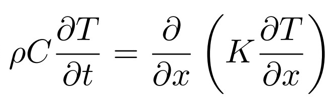
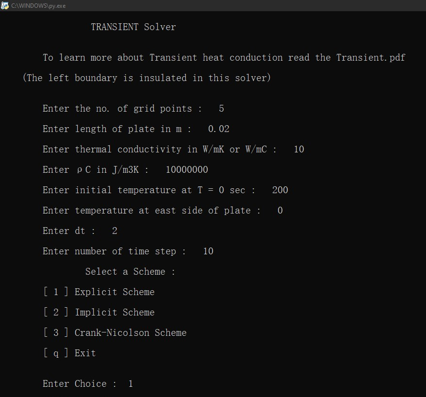
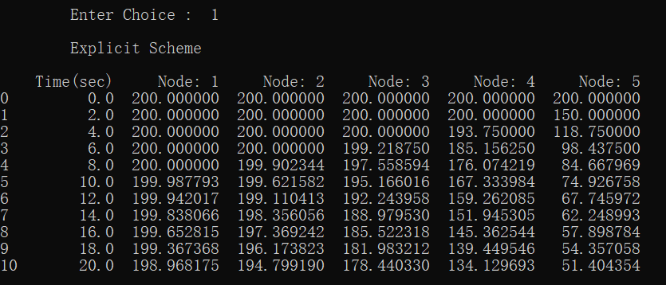

# TRANSIENT-1D-Unsteady State Diffusion solver
## Python code for Transient 1 Dimension Unsteady State Heat Conduction

Read _[Transient.pdf](Transient.pdf)_ in the repository to understand the Transient 1D unsteady state diffusion. The **time step dt** should be selected as per the condition mentioned in the notes pdf page 4 for Explicit, page 6 for Crank Nicolson.

The _governing equation_ used in the python code is

The python code has all the necessary comments to understand the solver.

_**Note** : In this solver cross sectional area is not required as we deal in one dimension only, so we measure unsteady heat conduction across the length only._

## Motivation
To learn Python programming and use python packages.

## Dependencies
- [Python](https://python.org) 3.9.5

- [Pandas](https://pandas.pydata.org) 1.2.4

- [Openpyxl](https://openpyxl.readthedocs.io) 3.0.7

## Output
User input data :

Solution which is printed in tabular form :

Export result to output folder :

_**Note** : Previous saved result will be overwritten so copy the previous result to some other folder._

## License

[Apache License 2.0](LICENSE)

## Author

[Yahya Ansari](https://github.com/novus-afk)
